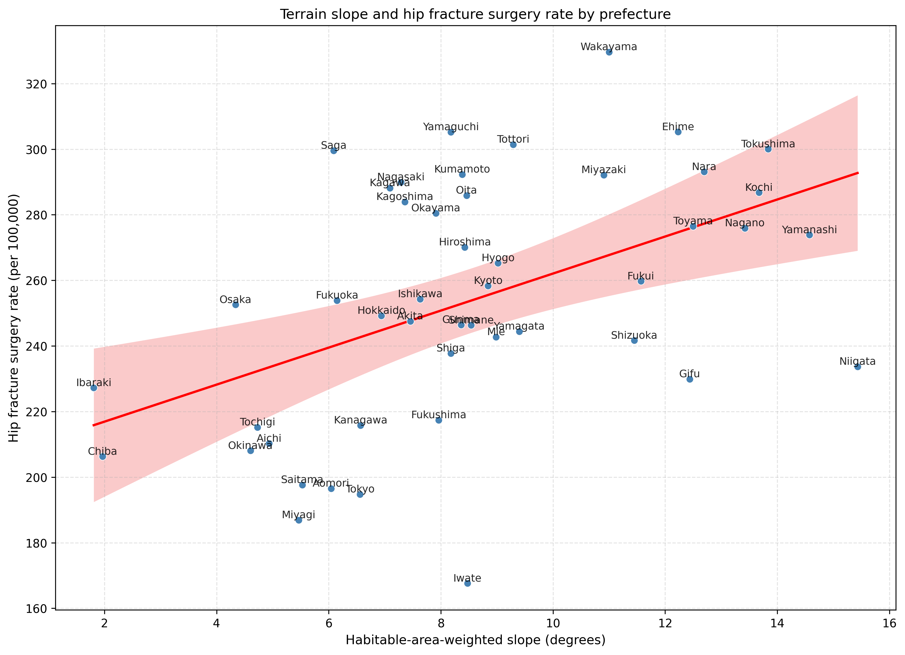
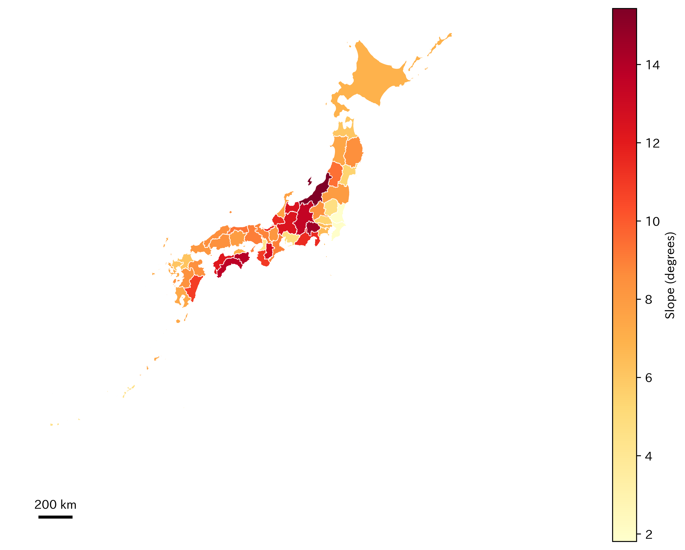
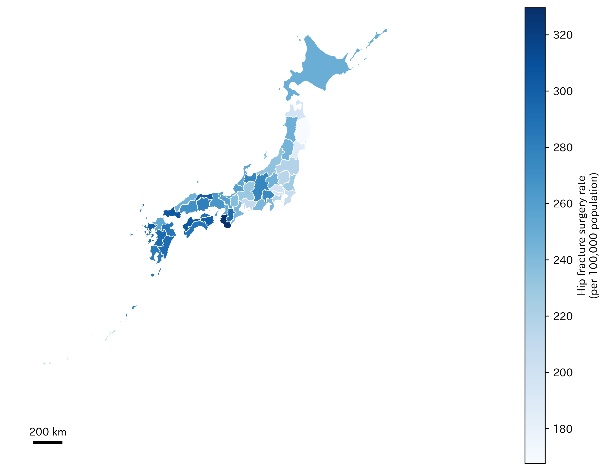
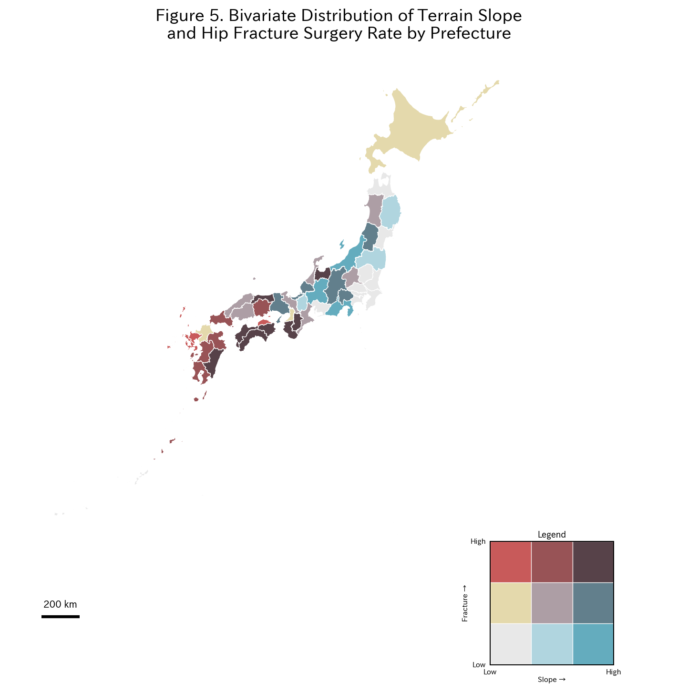

# Abstract

Hip fractures place a heavy burden on older adults in Japan. Whether steeper regional terrain relates to hip fracture surgery rates across prefectures remains unclear. We studied all 47 Japanese prefectures in an ecological design. We linked prefecture-level data from national open sources. Annual fracture surgery rates (per 100,000 population per year) came from the 10th National Database (NDB) Open Data (Reiwa 5 health insurance claims, April 2023 through March 2024). Habitual fast walking came from Reiwa 4 Specific Health Checkup tabulations (April 2022 through March 2023). We calculated habitable-area-weighted mean terrain slope from national 10-m digital elevation models. Proportion aged ≥65 years and population density came from the 2020 census. We used multivariable linear regression to test whether terrain slope was independently associated with hip fracture surgery rates after adjustment for proportion aged ≥65 years, fast-walking proportion, and population density. Across prefectures, the mean terrain slope was 8.57 degrees (SD, 3.16). Slopes ranged from 1.81 degrees in Ibaraki to 15.43 degrees in Niigata, reflecting how steep residential land is in each prefecture. The mean annual hip fracture surgery rate was 254.0 per 100,000 population (SD 37.6). Before adjustment for proportion aged ≥65 years, fast-walking proportion, and population density, each additional degree of slope corresponded to approximately 5.7 additional hip fracture surgeries per 100,000 population (95% CI, 2.50–8.79; *p* = 0.001). After adjustment for those covariates, terrain slope was positively associated with annual hip fracture surgery rates. Each additional degree of slope corresponded to approximately 3.5 additional hip fracture surgeries per 100,000 population (95% CI, 0.11–6.86; *p* = 0.043). The adjusted association was specific to hip fracture surgery rates and was not observed for humerus or forearm fracture surgery rates.

**Keywords**: terrain; slope; hip; fracture; ecology; Japan; epidemiology

---

# Introduction

Hip fracture is a serious public health problem among older adults worldwide. In Japan, approximately 200,000 hip fractures occur annually, and this number is projected to increase with the ongoing demographic shift toward an aging society.[1, 2] Hip fracture leads to prolonged hospitalization, functional decline, institutionalization, and increased mortality, imposing a substantial burden on both individuals and the healthcare system.[1, 3] The acute care costs of hip fracture treatment in Japan reached approximately 1,000 billion yen ($989 million) in 2021, and this burden continues to escalate.[4, 5]

Falls are the primary cause of hip fractures, accounting for more than 90% of cases.[6] Multiple risk factors for falls have been identified, including muscle weakness, impaired gait and balance, polypharmacy, and visual impairment.[7] Among environmental factors, home hazards such as slippery floors, steps, and inadequate lighting are well recognized.[8] However, broader environmental determinants of fall risk at the community level, such as outdoor terrain characteristics, have received limited attention despite their potential population-level impact.[9]

Terrain slope is a plausible environmental determinant of fall-related fractures. Walking on inclined surfaces requires greater neuromuscular effort and alters biomechanics, increasing instability, particularly among older adults with impaired balance and reduced muscle strength.[10, 11] The control of body center of mass (CoM) during inclined walking becomes increasingly challenging with age, as margin of stability (MoS) decreases and required coefficient of friction (RCOF) changes unpredictably on uneven terrain.[12, 13] Regions with steeper terrain may expose residents to greater fall risk during daily outdoor activities, including commuting and shopping. Japan's varied topography—ranging from flat coastal plains to steep mountain foothills—provides a natural laboratory to test this hypothesis at a nationwide scale.

Previous studies have demonstrated that environmental terrain features are associated with physical activity levels and walking speed in community-dwelling older adults.[14] Walking speed is itself a powerful predictor of fracture risk [15, 16] and has been designated the "sixth vital sign."[17] Older adults walking on complex outdoor terrain unconsciously adopt cautious gait strategies, reducing step length and cadence, which may lead to chronic deconditioning and increased frailty.[18, 19] Competing mechanisms are also plausible. Daily walking on slopes may strengthen lower-limb function, but car-dependent travel may be more common in steep or rural prefectures and reduce slope-specific walking exposure. We therefore hypothesized that steeper terrain may be associated with higher prefecture-level hip fracture surgery rates. We treated these rates as administrative proxies for population-level surgical burden after hip and femoral fractures. The association may reflect direct mechanical effects of inclined walking (direct pathway). It may also relate to walking capacity (indirect pathway).

Despite these theoretical considerations, no nationwide study has examined the association between prefectural-level terrain slope and fracture surgery rates using population-based administrative data. International ecological studies from Norway (NOREPOS) and China (CHARLS) have demonstrated significant associations between high elevation, complex terrain, and elevated hip fracture risk,[20, 21] but Japan-specific nationwide evidence has been lacking. The National Database (NDB) of Health Insurance Claims, released as open data by Japan's Ministry of Health, Labour and Welfare, provides a unique opportunity to assess fracture surgery rates across all 47 Japanese prefectures. Combined with digital elevation model (DEM) data from the Geospatial Information Authority of Japan, this ecological approach enables the first nationwide quantitative assessment of the terrain–fracture surgery relationship in Japan.

In this study, we examined whether terrain slope was associated with hip fracture surgery rates across prefectures. We adjusted for proportion aged ≥65 years, fast-walking proportion, and population density using nationwide administrative and geospatial data. NDB Open Data provide procedure counts, not fracture incidence. We therefore interpreted prefecture-level surgery rates as administrative proxies for fracture-related surgical burden. Not all fractures receive surgery, and operative thresholds may vary across regions.

---

# Methods

## 1. Study Design

We conducted a nationwide ecological study in which the Japanese prefecture (N = 47) served as the unit of analysis. Prefecture-level aggregate data were used because individual-level geospatial information is not available from NDB Open Data. The analysis used open-data tables from the **10th NDB Open Data** release: fracture-related procedure counts correspond to **Reiwa 5 fiscal year** (April 2023 through March 2024) health insurance claims, whereas Specific Health Checkup aggregates used for walking speed correspond to **Reiwa 4 fiscal year** (April 2022 through March 2023), as defined in Ministry of Health, Labour and Welfare documentation for that release.

## 2. Outcome: Fracture Surgery Rates

We obtained fracture surgery rates from the **10th NDB Open Data** (released 30 May 2025). This release reports prefecture-level procedure counts from **Reiwa 5 fiscal year** claims (April 2023 through March 2024) under the national health insurance system. We extracted three site-specific categories: (1) hip (femur) fracture surgery, (2) humerus fracture surgery, and (3) forearm fracture surgery. We defined **total fracture surgery rate** as the sum of these three site-specific counts per 100,000 population. We divided counts by 2020 National Census population to obtain annual rates per 100,000. We interpreted these rates as administrative proxies for surgical burden rather than as unbiased measures of fracture incidence.

## 3. Exposure: Terrain Slope

Terrain slope was calculated from a 10-m resolution digital elevation model (DEM) provided by the Geospatial Information Authority of Japan (Fundamental Geospatial Data). For each prefecture, the slope angle (degrees) was computed as the arctangent of the maximum rate of elevation change between each grid cell and its eight neighbors. We computed a habitable-area-weighted mean slope, in which each grid cell was weighted by an indicator of whether the land is classified as habitable (i.e., residential, agricultural, or commercial zones), following established methods for quantifying topographic exposure of residential populations.[10]

## 4. Covariate: Walking Speed

The proportion of individuals who reported walking fast (proportion with fast habitual walking, %) was derived from the NDB Specific Health Checkup (Tokutei Kenko Shinsa) questionnaire administered as part of the national annual health screening program. In the 10th NDB Open Data release, prefecture-level Specific Health Checkup tabulations correspond to **Reiwa 4 fiscal year** (April 2022 through March 2023), which does not coincide with the Reiwa 5 claims window used for fracture outcomes. Participants aged 40–74 years responded to a question on habitual walking speed, and we calculated the prefecture-level proportion of respondents who reported "fast" walking.

## 5. Additional Covariates

The proportion of individuals aged ≥65 years (%) was obtained from the 2020 National Census. Population density (persons per km²) was calculated as total population divided by prefecture area from the same source.

## 6. Statistical Analysis

We summarized prefecture-level distributions using mean, SD, median, 25th and 75th percentiles, minimum, and maximum. Pearson correlation coefficients were computed between terrain slope and each outcome and covariate variable. We fit two regression models for each fracture outcome:

- **Model 1 (unadjusted)**: Simple linear regression of fracture rate on terrain slope only.
- **Model 2 (multivariable)**: Multiple linear regression of fracture rate on terrain slope, proportion aged ≥65 years, fast-walking proportion, and population density.
In the primary causal interpretation, proportion aged ≥65 years and fast-walking proportion were treated as confounder-adjustment variables rather than formal mediators.

Model performance was assessed using the coefficient of determination (R²), adjusted R², and the F-statistic. Regression coefficients (β) and 95% confidence intervals (CIs) are reported. Statistical significance was defined as *p* < 0.05 (two-sided). All analyses were performed using Python (version 3.14.2) with `statsmodels` (version 0.14.6). Linear regression models were estimated by ordinary least squares (OLS) using the `statsmodels` formula interface (`statsmodels.formula.api.ols`).

For the primary hip-fracture outcome (Model 2), we assessed linear model assumptions graphically using residuals-versus-fitted and normal quantile–quantile (Q–Q) plots of OLS residuals, and we report the Shapiro–Wilk test on residuals for descriptive completeness (small-*N* tests are interpreted cautiously). Because prefecture-level ecological analyses can exhibit heteroskedasticity and leverage from skewed covariates (notably population density), we conducted sensitivity analyses: (1) heteroskedasticity-robust standard errors (HC3) for two-sided *p* values and CIs, and (2) a nonparametric bootstrap with *B* = 5,000 resamples of prefectures (with replacement) to obtain a percentile 95% CI for the terrain slope coefficient.
Given *N* = 47 with multiple covariates, we also checked coefficient stability and multicollinearity diagnostics (including model condition number) and interpreted estimates cautiously.
As an additional sensitivity analysis for age-structure confounding, we performed indirect standardization for the femur-surgery outcome. We combined NDB age-stratified surgery tables with 2020 census 5-year age-group population counts from e-Stat. Some age-stratified surgery counts in public NDB Open Data are withheld for disclosure control. These counts appear as a hyphen (`"-"`) in the tables. We prespecified three replacement scenarios: 0, 5, or 9 surgeries per withheld cell. We repeated indirect standardization under each scenario. For each scenario, we calculated national age-specific surgery rates, expected prefectural counts, the standardized incidence ratio (SIR; observed-to-expected surgery count ratio), and the indirectly standardized surgery rate (per 100,000), computed as SIR times the national crude surgery rate. We then regressed the indirectly standardized rate on terrain slope with and without covariate adjustment. These analyses were treated as sensitivity analyses only (not primary inference), given potential secondary masking.

All manuscript figures were generated programmatically from study data using reproducible Python workflows: Python 3.14.2 with `pandas` 2.3.3, `numpy` 2.3.5, `matplotlib` 3.10.8, `seaborn` 0.13.2, `scipy` 1.16.3, `geopandas` 1.1.2, and `japanize_matplotlib` 1.1.3. Figure 1 was generated via linear-fit visualization from the prefecture-level analytical dataset, and Figures 2–4 by joining prefecture-level indicators to national prefectural boundary geodata and rendering choropleth maps.

This study used publicly available aggregate data; individual informed consent was not required, and institutional ethics review was not applicable in accordance with Japanese ethical guidelines for epidemiological research.

---

# Results

## 1. Descriptive Statistics

Across the 47 Japanese prefectures, the mean habitable-area-weighted terrain slope was 8.57 ± 3.16 degrees (median 8.36; interquartile range [IQR] 6.56–10.95; range 1.81 degrees in Ibaraki–15.43 degrees in Niigata) (Table 1). The mean hip fracture surgery rate was 254.0 ± 37.6 per 100,000 population (median 253.9; IQR 228.6–286.3; range 167.6–329.6), and the mean total fracture surgery rate was 352.8 ± 54.9 per 100,000 (median 356.1; IQR 306.4–397.1). The mean proportion aged ≥65 years was 30.7 ± 3.1% (median 31.3%; IQR 29.3–32.9%), and the mean fast-walking proportion was 48.6 ± 4.3% (median 49.2%; IQR 46.2–51.2%). Population density was right-skewed (mean 657 persons/km² versus median 265; IQR 173–469).

## 2. Correlation Analysis

Bivariate correlations are summarized in Table 2 and illustrated for the primary exposure–outcome pair in Figure 1. Terrain slope correlated positively with hip fracture surgery rate (r = 0.475, *p* < 0.01) and with total fracture surgery rate (r = 0.394, *p* < 0.01). Slope correlated positively with proportion aged ≥65 years (r = 0.505, *p* < 0.01) and showed a weak negative correlation with fast-walking proportion (r = −0.264, *p* = 0.073). Correlations with humerus and forearm surgery rates were weak and non-significant (r = 0.138 and 0.177, respectively).

## 3. Regression Analysis: Hip Fracture

In the unadjusted model (Model 1), terrain slope was significantly and positively associated with hip fracture surgery rate (β = 5.65; 95% CI, 2.50–8.79; R² = 0.225; *p* = 0.001). After adjustment for proportion aged ≥65 years, fast-walking proportion, and population density (Model 2), the slope coefficient was 3.49 (95% CI, 0.11–6.86; R² = 0.385; *p* = 0.043) using conventional (model-based) standard errors (Table 3). Proportion aged ≥65 years was also associated with hip fracture rate (β = 5.53; 95% CI, 1.32–9.74; *p* = 0.011). Fast-walking proportion was positively associated with hip fracture rate under HC3 robust inference (β = 2.02; 95% CI, 0.29–3.74; *p* = 0.022) but not under conventional standard errors (β = 2.02; 95% CI, −0.34–4.37; *p* = 0.091). Population density was not significantly associated with hip fracture rate (β = −0.001; *p* = 0.818).

Residual diagnostics for Model 2 did not indicate gross deviations from linearity in residuals versus fitted values. The Shapiro–Wilk test on OLS residuals was *W* = 0.957 (*p* = 0.079). Sensitivity analyses, however, indicated inferential fragility for the primary slope coefficient at *N* = 47: heteroskedasticity-robust (HC3) 95% CIs were −0.19 to 7.17 (*p* = 0.063), and a nonparametric bootstrap 95% CI (prefecture resampling, *B* = 5,000) was −0.03 to 7.09.

Indirect standardization sensitivity analyses addressed age-structure confounding (Methods). In public NDB tables, some age-by-prefecture surgery counts are withheld for disclosure control and appear as a hyphen (`"-"`). We replaced each withheld cell with 0, 5, or 9 surgeries in prespecified scenarios and regressed the indirectly standardized hip (femur) surgery rate on terrain slope, adjusting for proportion aged ≥65 years, fast-walking proportion, and population density. When withheld counts were replaced by 0 surgeries, the slope coefficient was 5.71 (95% CI, 0.54–10.88; *p* = 0.031). When each withheld cell was replaced by 5 or 9 surgeries, β was 3.61 (95% CI, 0.30–6.92; *p* = 0.033) and 3.64 (95% CI, 0.28–7.00; *p* = 0.035), respectively (Table 5). The association direction was stable across scenarios, but the effect size depended on the replacement assumption.

## 4. Regression Analysis: Total, Humerus, and Forearm Fractures

In the unadjusted model, slope was significantly associated with total fracture surgery rate (β = 6.85; 95% CI, 2.06–11.64; R² = 0.156; *p* = 0.006). In the multivariable model, however, slope did not reach statistical significance for total fracture rate (β = 4.47; *p* = 0.099), although proportion aged ≥65 years remained a significant predictor (β = 7.19; *p* = 0.035; R² = 0.276). Neither humerus fracture rate (Model 1: *p* = 0.355; Model 2: R² = 0.107) nor forearm fracture rate (Model 1: *p* = 0.233; Model 2: R² = 0.062) was significantly associated with terrain slope in either model.

---

# Discussion

## 1. Main Findings

This ecological study showed a positive association between prefectural-level terrain slope and hip fracture surgery rates after adjustment for proportion aged ≥65 years, walking speed, and population density (β = 3.49 per one-degree increase; conventional 95% CI, 0.11–6.86; *p* = 0.043), while acknowledging that heteroskedasticity-robust and bootstrap intervals for the slope coefficient were compatible with no association at α = 0.05. Each additional degree of slope corresponded to approximately 3.5 additional hip fracture surgeries per 100,000 population under the primary OLS parameterization. The adjusted association was specific to hip fractures and was not observed for humerus or forearm fractures. These findings suggest that, at the prefecture level, residence in prefectures with steeper habitable terrain may be associated with greater hip-specific surgical burden beyond compositional aging and self-reported walking pace.

## 2. Biological Plausibility

The slope-fracture association observed for the hip may be biologically plausible and may be partly supported by biomechanical evidence. Hip fractures typically result from lateral (sideways) falls,[22, 23] which are common fall mechanisms on inclined surfaces. Real-world video-capture studies of falls in long-term care facilities have demonstrated that lateral landing configuration increases hip fracture risk by 5.5 to 6-fold compared to forward or backward falls, and direct impact to the greater trochanter elevates fracture risk by up to 30-fold.[23, 24] The impact forces generated during lateral falls typically reach 2,000 to 4,000 N, exceeding the physiological tolerance of osteoporotic femoral necks.[25] Finite element method (FEM) simulations have further suggested that posterolateral and lateral impacts generate maximum tensile and compressive stresses at the superior and inferior aspects of the femoral neck, potentially increasing fracture vulnerability.[26]

When walking downhill or across a slope, the body's center of mass (CoM) shifts laterally, and the control of lateral stability becomes increasingly difficult.[27, 28] The human gait pattern is biomechanically analogous to an inverted pendulum, with CoM tracing a bow-tie-shaped trajectory in three-dimensional space.[28] On sloped terrain, maintaining CoM within the base of support (BoS) requires precise step-by-step adjustments of step width and foot placement.[29] For older adults with age-related declines in hip abductor strength and ankle dorsiflexion, the margin of stability (MoS) during inclined walking is dramatically reduced.[11, 13] Slips or minor perturbations that could be corrected via cross-over steps on flat surfaces become unarrested lateral falls on slopes due to delayed postural reflexes and environmental constraints.[12, 28]

In contrast, wrist (forearm) fractures are more commonly caused by protective extension reflexes during forward falls on flat surfaces.[30] When falling forward, individuals instinctively extend their arms to protect the head and torso, and kinematic studies show that elbow flexion and wrist dorsiflexion absorb fall energy, dramatically reducing pelvic impact velocity.[30] Such forward falls typically occur from tripping on minor obstacles or steps indoors, rather than from rapid lateral displacement on steep slopes.[31] Similarly, humerus fractures in older adults often result from low-energy obliquely forward falls on level ground and occur in relatively younger, more ambulatory individuals who retain arm-protective reflexes.[32] The fracture-site specificity observed in our data—significant association with hip fractures but not with humerus or forearm fractures—provides internal evidence that is consistent with a biomechanical paradigm in which terrain slope may specifically amplify lateral fall risk.

## 3. Comparison with Previous Studies

Our findings align with and extend international ecological studies examining geospatial determinants of hip fracture risk. The Norwegian Epidemiologic Osteoporosis Studies (NOREPOS), conducted in one of the world's highest hip fracture incidence countries, used GIS-linked nationwide hospital records to demonstrate that residents of inland, high-elevation, topographically complex areas experienced significantly higher hip fracture incidence compared to those in flat coastal regions.[20] The NOREPOS investigators further identified that cold ambient temperature and icy terrain in mountainous areas amplified this geographic risk,[33] a finding with direct relevance to Japan's snowy and steep prefectures (e.g., Niigata, which had the steepest habitable-area-weighted slope nationally, and inland prefectures such as Nagano, which also ranked among the steepest).

In Asia, a recent retrospective cohort analysis using data from the China Health and Retirement Longitudinal Study (CHARLS) demonstrated that exposure to high altitude and steep terrain was associated with a 1.65-fold elevated hazard ratio for hip fracture, with particularly pronounced effects among overweight individuals and women.[21] These findings reinforce the generalizability of our results across diverse geographic and ethnic contexts.

Previous ecological studies have also examined the relationship between outdoor environment and fall-related injuries. Studies in multiple countries found that neighborhood green space, walkability, and environmental safety were associated with fall-related hospital admissions and fracture risk.[34] In Japan, Fujita et al. reported that frequent outdoor activity predicts physical function in rural community-dwelling older adults.[14] However, to our knowledge, no prior study has used nationwide DEM data linked to administrative fracture data to quantify the dose-response association between terrain slope and hip fracture rates at the population level in Japan. Our findings add nationwide quantitative evidence that each one-degree increase in terrain slope was associated with approximately 3.5 additional hip fracture surgeries per 100,000 population, independent of proportion aged ≥65 years in the primary model. This quantitative estimate may contribute to the global evidence base for terrain as a modifiable environmental correlate of fracture burden.

## 4. Proportion Aged ≥65 Years

Proportion aged ≥65 years was the strongest predictor of hip fracture rate in the multivariable model (β = 5.53, *p* = 0.011). Prefectures with steeper terrain also tended to have higher proportions aged ≥65 years (r = 0.505), reflecting the well-documented trend of rural aging in Japan, where mountainous prefectures experience greater outmigration of younger populations.[35, 36, 37] Older adults in these high-slope prefectures thus face a double burden: the physical challenge of navigating harsh terrain on a daily basis (environmental hazard) and the social isolation and lack of medical access associated with rural depopulation (social determinants of health).[38, 39]

The partial association of slope with hip fracture after adjustment for proportion aged ≥65 years suggests that terrain may constitute a risk correlate over and above demographic composition, subject to the inferential sensitivity noted above. This finding has practical implications: even within the context of Japan's nationwide aging, geographic topography may represent an additional and potentially modifiable layer of fracture risk. Terrain slope may not be merely a proxy for aging and may represent an additional environmental correlate that could contribute to functional decline among rural-dwelling older adults.
Given public-data masking in age-stratified surgery tables, we interpret age-structure robustness primarily from the consistency of adjusted ecological models and from imputation-based sensitivity analyses, while acknowledging that full indirect standardization without imputation is not feasible with the current open dataset.

## 5. Walking Speed as a Mediator

At the individual level, slower walking speed is a well-established marker of fracture risk, sarcopenia, frailty, and mortality (often termed the "sixth vital sign").[15, 16, 17] Prospective cohort studies in community-dwelling older adults have demonstrated that walking speeds below 0.8 m/s or 0.69 m/s significantly elevate hip fracture incidence.[16] Walking speed measured in clinical settings (flat 10-meter walk tests) may not accurately reflect real-world walking ability on complex outdoor terrain.[18]

In our ecological data, terrain slope was negatively correlated with prefecture-level fast-walking proportion (r = −0.264, *p* = 0.073), consistent with residents of steeper prefectures reporting slower habitual walking on average. When confronted with uneven or sloped terrain, older adults unconsciously adopt cautious gait strategies, reducing step length and cadence to enhance stability, which results in substantially slower walking speeds.[11, 18, 19] Older adults residing in high-slope regions are exposed to such challenging terrain daily during shopping and outdoor activities, leading to chronic fear of falling, reduced outdoor activity, and progressive deconditioning (disuse muscle atrophy).[40, 41]

However, the multivariable OLS coefficient for fast-walking proportion was **positive** (β = 2.02 per 1 percentage-point increase in fast walking), which is difficult to interpret as a causal protective effect at prefecture resolution and is not the individual-level association described in cohort studies. Inference for this coefficient was sensitive to standard error choice (conventional *p* = 0.091 versus HC3 *p* = 0.022). Plausible drivers include ecological bias, aggregation of a 40–74-year screening metric to represent regions where hip fractures concentrate among the oldest-old, and confounding by unmeasured healthcare and reporting behaviors. Because only the 40–74-year questionnaire aggregate is publicly available, we treated this variable as a contextual covariate and not as a direct proxy for hip fracture risk in the oldest age groups. We therefore did not treat walking speed as a statistically supported mediator of the slope–hip fracture association. Future studies using individual-level data (e.g., objectively measured gait speed, accelerometry) with formal causal mediation analysis are warranted to clarify whether terrain slope influences hip fracture risk partly through its chronic effect on habitual walking capacity.

## 6. Policy Implications

Our findings have concrete policy implications in the context of Japan's national health promotion strategies and the ongoing escalation of hip fracture healthcare costs. The NDB trends from 2012 to 2023 demonstrate that hip fracture incidence, which had plateaued temporarily, resumed an upward trajectory after 2021, likely reflecting COVID-19-related outdoor activity restrictions and accelerated frailty.[4, 42, 43] Acute care costs for hip fracture treatment reached approximately 1,000 billion yen in 2021,[5] prompting the Japanese government to introduce a new reimbursement incentive in April 2022 for early surgery within 48 hours for patients aged ≥75 years.[44]

First, prefectures with steeper terrain should be prioritized in national fall prevention programs. Japan's Ministry of Health, Labour and Welfare has promoted the "Active Guide" (Plus-Ten campaign: "add 10 minutes of physical activity daily") under the Health Japan 21 (second edition) framework.[45, 46] However, research has shown that physical activity behavior is strongly dependent on neighborhood environmental features (sidewalk availability, safety, topography), not individual motivation alone.[45] Recommending "10 additional minutes of outdoor walking" in mountainous prefectures with mean slopes exceeding 10 degrees (e.g., regions in Shikoku, Chugoku, inland Kyushu) may inadvertently increase lateral fall and hip fracture risk without concurrent environmental modifications. High-slope regions require environment-specific adaptations of the Active Guide, including balance and strength training programs, anti-slip footwear distribution, and handrail installation subsidies for outdoor pathways.[47]

Second, housing modification subsidies targeting high-slope prefectures—such as installation of handrails on outdoor pathways and anti-slip surface materials—could reduce the environmental contribution to fall risk. Third, urban planning guidelines for mountainous communities should explicitly incorporate slope gradient as a factor in pedestrian infrastructure design, particularly in areas with high proportions of older residents. Given the irreversible demographic aging in rural Japan, these upstream environmental interventions represent cost-effective strategies to mitigate the downstream burden of fragility fractures.

## 7. Strengths

This study has several strengths. We used nationally representative administrative data covering all 47 Japanese prefectures, ensuring that results were not subject to selection bias affecting individual-level studies. The use of DEM-derived weighted slope measures provides an objective, reproducible quantification of terrain exposure. The fracture outcomes were ascertained from insurance claims, which are routinely recorded with high administrative accuracy. The fracture-site specificity observed (hip but not forearm or humerus) provides internal evidence consistent with the proposed biomechanical mechanism.

## 8. Limitations

Several limitations should be considered. First, as an ecological study, our findings are subject to the ecological fallacy: associations observed at the prefecture level may not reflect individual-level relationships.[48] We cannot establish whether individuals living in steeper terrain within a prefecture have higher fracture risk than those in flatter areas of the same prefecture. Individual-level studies with residential geocoding and objective measures of daily terrain exposure (e.g., GPS tracking, accelerometry) are necessary to confirm our prefecture-level findings. Relatedly, fracture procedure counts (Reiwa 5), Specific Health Checkup walking-speed aggregates (Reiwa 4), and 2020 census denominators are not temporally co-extensive; we therefore interpret results as an administrative-data snapshot rather than a strictly harmonized single-year cohort.

Second, our outcome reflects surgery rates rather than true fracture incidence. Although hip fractures are usually treated surgically, prefectural variation in treatment decisions, referral patterns, and access to operative care may influence observed rates independently of fracture occurrence. Third, the cross-sectional design precludes causal inference. Although reverse causation is unlikely for a fixed environmental exposure such as terrain slope, residual confounding by unmeasured variables cannot be excluded. Fourth, important unmeasured confounders—including individual-level socioeconomic status, healthcare access (e.g., prefectural orthopedic surgeon density, distance to emergency hospitals), nutritional status (calcium and vitamin D intake), bone mineral density (BMD), climate (snowfall and icing), and medication use (bisphosphonates, vitamin D supplementation)—may account for part of the observed association. Future studies incorporating NDB prescription data and BMD screening results at finer geographic resolution would strengthen causal inference.

Fifth, age-standardization sensitivity results relied on replacing withheld (disclosure-controlled) cells in publicly released age-stratified surgery tables with prespecified surgery counts (0, 5, or 9). Although directionality was robust across these scenarios, effect size depended on the replacement assumption, and secondary masking rules imply that some withheld cells may not correspond strictly to the nominal `<10` range. Therefore, these indirect standardization sensitivity analyses should be interpreted as robustness checks rather than definitive age-standardized estimates. Sixth, the walking speed variable was based on self-reported habitual walking speed in the Specific Health Checkup questionnaire, administered to individuals aged 40–74 years, because publicly available prefecture-level data were limited to individuals aged 40–74 years in the current NDB Open Data. This variable may not accurately represent the functional capacity of the oldest-old (≥75 years) at highest fracture risk, and its direct relevance to hip fracture occurrence is likely limited at this ecological resolution. Moreover, this self-reported fast-walking indicator primarily reflects perceived walking capacity rather than actual walking volume or direct slope-specific exposure in daily life. This self-reported measure may be subject to non-differential measurement error, biasing our estimates toward the null. Seventh, the DEM-based slope calculation reflects the topographic exposure of the prefecture as a whole and does not capture micro-scale terrain variations (e.g., steep residential pathways, stairways) encountered during daily activities by individual residents. High-resolution spatial analysis at the municipal or neighborhood level would provide more granular insights into the terrain–fracture relationship.

Eighth, with only 47 prefectures, regression inference can be sensitive to heteroskedasticity and leverage from skewed covariates (especially population density). Our sensitivity analyses (HC3 robust standard errors and nonparametric bootstrap resampling of prefectures) indicated that the conventional *p* = 0.043 result for the primary slope coefficient in Model 2 was borderline and compatible with no association under alternative variance assumptions.

Ninth, sex- and gender-stratified outcome tables were not available in the prefecture-level NDB Open Data extracts used here; findings therefore describe aggregate populations and should be interpreted with this limitation in mind.

---

# Conclusions

Under primary ordinary least squares estimation, prefectural terrain slope was positively associated with hip fracture surgery rates after adjustment for proportion aged ≥65 years, walking speed, and population density (β ≈ 3.5 additional surgeries per 100,000 per one-degree increase; conventional *p* = 0.043), whereas heteroskedasticity-robust and bootstrap uncertainty quantification yielded borderline support compatible with no association at α = 0.05. Given the limited ecological sample size (*N* = 47), these findings should be interpreted as suggestive rather than confirmatory. The adjusted signal was specific to hip fractures, with no significant relationship observed for humerus or forearm fractures, consistent with biomechanical hypotheses emphasizing lateral falls and trochanteric loading on sloped terrain.

Future studies using individual-level data with residential geocoding, objective gait measurements, formal causal mediation analysis, and high-resolution spatial modeling are warranted to delineate the precise causal pathways—direct biomechanical effects versus chronic functional decline—underlying the terrain–fracture association observed at the population level.

---

# Data availability

Aggregate data used in this study are publicly available from the Japanese National Database Open Data and official statistics cited in the Methods. Under Ministry of Health, Labour and Welfare distribution rules, individual-level claims and identifiable records cannot be shared. Prefecture-level values supporting this analysis can be reproduced from those public sources using the procedures described. We encourage deposition of analysis code and derived prefecture-level tables in a public repository (e.g., Zenodo) with a DOI and citation in this article, in line with the journal's research data guidance (Option B). Author contributions will be reported using the CRediT taxonomy on the separate title page required for double-anonymized submission.

---

# Declaration of generative AI and AI-assisted technologies in the manuscript preparation process

During the preparation and writing of this work, the authors used AI-assisted tools to support manuscript drafting and statistical analysis scripting. Cursor 2.0 (Anysphere) and Google Antigravity (Google) were used for AI-assisted writing and Python code development. Large language models used through these platforms included Claude Sonnet 4.6 and Claude Opus 4.6 (Anthropic) and Gemini 3 Pro (Google). These tools were used only for text drafting and code generation; no generative AI or AI-assisted tools were used to create, alter, or otherwise process any figures, images, or artwork in this manuscript. The authors reviewed and edited all AI-assisted outputs and were responsible for the study design, selection of statistical methods, interpretation of findings, conclusions, and final reference list. The authors take full responsibility for the integrity and accuracy of the final content. AI was not listed as an author.

---

# References

[1] Hagino H, Katagiri H, Okano T, Yamamoto K, Teshima R. Increasing incidence of hip fracture in Tottori Prefecture, Japan: trend from 1986 to 2001. Osteoporos Int. 2005;16(12):1963-1968.
[2] Orimo H, Yaegashi Y, Hosoi T, Fukushima Y, Onoda T, Hashimoto T, et al. Hip fracture incidence in Japan: estimates of new patients in 2012 and 25-year trends. Osteoporos Int. 2016;27(5):1777-1784.
[3] Cooper C, Campion G, Melton LJ 3rd. Hip fractures in the elderly: a world-wide projection. Osteoporos Int. 1992;2(6):285-289.
[4] Nakatoh S, Fujimori K, Ishii S, Iki M. Trends in the incidence of hip fractures and osteoporosis treatment in Japan (FY2012–FY2023). Arch Osteoporos. 2025; 21(1):16.
[5] Hatano M, Yasunaga H, Ishikura H, et al. Temporal trends in acute care costs of hip fracture treatment from 2011 to 2021 in Japan. Arch Osteoporos. 2025;20(1):124.
[6] Cummings SR, Nevitt MC. A hypothesis: the causes of hip fractures. J Gerontol. 1989;44(4):M107-M111.
[7] Tinetti ME. Clinical practice. Preventing falls in elderly persons. N Engl J Med. 2003;348(1):42-49.
[8] Stevens JA, Sogolow ED. Gender differences for non-fatal unintentional fall related injuries among older adults. Inj Prev. 2005;11(2):115-119.
[9] Li W, Keegan TH, Sternfeld B, Sidney S, Quesenberry CP Jr, Kelsey JL. Outdoor falls among middle-aged and older adults: a neglected public health problem. Am J Public Health. 2006;96(7):1192-1200.
[10] Redfern MS, Cham R, Gielo-Perczak K, et al. Biomechanics of slips. Ergonomics. 2001;44(13):1138-1166.
[11] Franz JR, Kram R. Advanced age affects the individual leg mechanics of level, uphill, and downhill walking. J Biomech. 2013;46(3):535-540.
[12] Reimann H, Ramadan R, Fettrow T, Hafer JF, Geyer H, Jeka JJ. Interactions between different age-related factors affecting balance control in walking. Front Sports Act Living. 2020;2:94.
[13] Marigold DS, Patla AE. Strategies for dynamic stability during locomotion on a slippery surface: effects of prior experience and knowledge. J Neurophysiol. 2002;88(1):339-353.
[14] Fujita K, Fujiwara Y, Chaves PH, Motohashi Y, Shinkai S. Frequency of going outdoors as a good predictors for incident disability of physical function as well as disability recovery in community-dwelling older adults in rural Japan. J Epidemiol. 2006;16(6):261-270.
[15] Quach L, Galica AM, Jones RN, et al. The nonlinear relationship between gait speed and falls: the MOBILIZE Boston Study. J Am Geriatr Soc. 2011;59(6):1069-1073.
[16] Dargent-Molina P, Favier F, Grandjean H, et al. Fall-related factors and risk of hip fracture: the EPIDOS prospective study. Lancet. 1996;348(9021):145-149.
[17] Studenski S, Perera S, Patel K, et al. Gait speed and survival in older adults. JAMA. 2011;305(1):50-58.
[18] Thies SB, Richardson JK, Ashton-Miller JA. Effects of surface irregularity and lighting on step variability during gait: a study in healthy young and older women. Gait Posture. 2005;22(1):26-31.
[19] Maki BE. Gait changes in older adults: predictors of falls or indicators of fear. J Am Geriatr Soc. 1997;45(3):313-320.
[20] Dahl C, Madsen C, Omsland TK, Søgaard AJ, Tell GS, Holvik K, Meyer HE. Contribution of elevation and residential proximity to the coast in explaining geographic variations in hip fracture incidence. A Norwegian Epidemiologic Osteoporosis Studies (NOREPOS) study. Osteoporos Int. 2021;32(5):1001-1006.
[21] Wang S, Zhang F, Guo Y, Chen C, Zhong Y, Hao D, Zhu S, Wu Y. Exposure to high altitude is associated with an elevated risk of hip fracture: a retrospective cohort study using data from the CHARLS. BMC Geriatr. 2025;25(1):884.
[22] Nevitt MC, Cummings SR. Type of fall and risk of hip and wrist fractures: the study of osteoporotic fractures. J Am Geriatr Soc. 1993;41(11):1226-1234.
[23] Yang Y, Komisar V, Shishov N, et al. The effect of fall biomechanics on risk for hip fracture in older adults: a cohort study of video-captured falls in long-term care. J Bone Miner Res. 2020;35(10):1914-1922.
[24] Hayes WC, Myers ER, Morris JN, Gerhart TN, Yett HS, Lipsitz LA. Impact near the hip dominates fracture risk in elderly nursing home residents who fall. Calcif Tissue Int. 1993;52(3):192-198.
[25] Sarvi MN, Luo Y. A two-level subject-specific biomechanical model for improving prediction of hip fracture risk. Clin Biomech (Bristol, Avon). 2015;30(8):881-887.
[26] Faisal TR, Luo Y. Study of stress variations in single-stance and sideways fall using image-based finite element analysis. Biomed Mater Eng. 2016;27(1):1-14.
[27] Ortega JD, Farley CT. Minimizing center of mass vertical movement increases metabolic cost in walking. J Appl Physiol (1985). 2005;99(6):2099-2107.
[28] Tesio L, Rota V. The motion of body center of mass during walking: a review oriented to clinical applications. Front Neurol. 2019;10:999.
[29] Hak L, Houdijk H, Steenbrink F, Mert A, van der Wurff P, Beek PJ, van Dieën JH. Stepping strategies for regulating gait adaptability and stability. J Biomech. 2013;46(5):905-911.
[30] Kim KJ, Ashton-Miller JA. Biomechanics of fall arrest using the upper extremity: age differences. Clin Biomech (Bristol, Avon). 2003;18(4):311-318.
[31] O'Neill TW, Varlow J, Silman AJ, et al. Age and sex influences on fall characteristics. Ann Rheum Dis. 1994;53(11):773-775.
[32] Court-Brown CM, Caesar B. Epidemiology of adult fractures: a review. Injury. 2006;37(8):691-697.
[33] Dahl C, Madsen C, Omsland TK, et al. The association of cold ambient temperature with fracture risk and mortality: national data from Norway—a Norwegian Epidemiologic Osteoporosis Studies (NOREPOS) study. J Bone Miner Res. 2022;37(8):1527-1536.
[34] Blackwood J, Suzuki R, Karczewski H. Perceived neighborhood walkability is associated with recent falls in urban dwelling older adults. J Geriatr Phys Ther. 2022;45(1):E8-E15.
[35] Tabuchi R. Emerging trends in domestic migration patterns in Japan. Paper presented at: Expert Group Meeting in Celebration of the 30th anniversary of the International Year of the Family; February 28-29, 2024; Kuala Lumpur, Malaysia. Available from: https://researchmap.jp/read0048517/published_papers/47765231
[36] Consalvo S. Impact of population ageing on Japan's inter-prefectural migration. Data Science and Service Research Discussion Paper No. 129. Tohoku University, 2022.
[37] Smith SG, O'Conor R, Curtis LM, Waite K, Deary IJ, Paasche-Orlow M, Wolf MS. Low health literacy predicts decline in physical function among older adults: findings from the LitCog cohort study. J Epidemiol Community Health. 2015;69(5):474-480.
[38] Kobayashi K, Nishida T, Sakakibara H. Factors associated with low albumin in community-dwelling older adults aged 75 years and above. Int J Environ Res Public Health. 2023;20(21):6994.
[39] Murayama H, Nishi M, Matsuo E, et al. Do bonding and bridging social capital affect self-rated health, depressive mood and cognitive decline in older Japanese? A prospective cohort study. Soc Sci Med. 2013;98:247-252.
[40] Delbaere K, Close JC, Brodaty H, Sachdev P, Lord SR. Determinants of disparities between perceived and physiological risk of falling among elderly people: cohort study. BMJ. 2010;341:c4165.
[41] Kempen GI, van Haastregt JC, McKee KJ, Delbaere K, Zijlstra GA. Socio-demographic, health-related and psychosocial correlates of fear of falling and avoidance of activity in community-living older persons who avoid activity due to fear of falling. BMC Public Health. 2009;9:170.
[42] Inage K, Kondo N, Komatsubara S, et al. Current status of patients with hip fracture in Japan: a nationwide survey. J Orthop Sci. 2025. doi:10.1016/j.jos.2025.05.014.
[43] Nakatoh S, Fujimori K, Ishii S, Tamaki J, Okimoto N, Ogawa S, Iki M. Trends in the incidence of secondary hip fractures and osteoporosis treatment in Japan (FY2012-FY2023). Arch Osteoporos. 2026;21(1):15.
[44] Yamamoto N, Sawaguchi T, Matsushita T, et al. Fragility Fracture Network-Japan: the challenge of establishment of a national hip fracture database and successful achievement of nationwide health system change for hip fracture care in Japan. Injury. 2024;55(6):111452.
[45] Miyachi M, Tripette J, Kawakami R, Murakami H. "+10 min of physical activity per day": Japan is looking for efficient but feasible recommendations for its population. J Nutr Sci Vitaminol (Tokyo). 2015;61 Suppl:S7-9.
[46] Murakami H, Tripette J, Kawakami R, Miyachi M. "Add 10 min for your health": the new Japanese recommendation for physical activity based on dose-response analysis. J Am Coll Cardiol. 2015;65(11):1153-1154.
[47] Sherrington C, Fairhall NJ, Wallbank GK, et al. Exercise for preventing falls in older people living in the community. Cochrane Database Syst Rev. 2019;1(1):CD012424.
[48] Rothman KJ, Greenland S, Lash TL. Modern Epidemiology. 3rd ed. Philadelphia: Lippincott Williams & Wilkins; 2008.

---

# Tables and Figures

*Submission note (Health & Place):* tables must be submitted as editable text (not images). The journal requests avoiding vertical rules and cell shading in final Word typesetting; if borders appear after import from this document, remove vertical lines in the submission file. Figures must be supplied as separate image files in the submission system (e.g., `Figure_1.png`, `Figure_2.png`, …) with logical file names; embedded figures below are included for Quarto compilation and internal review only.

## Table 1. Descriptive Statistics of Prefecture-Level Variables (N = 47)

| Variable | Unit | N | Mean | SD | Median | Q1 | Q3 | Min | Max |
| :--- | :--- | ---: | ---: | ---: | ---: | ---: | ---: | ---: | ---: |
| **Outcome variables** | | | | | | | | | |
| Total fracture surgery rate | per 100,000 | 47 | 352.75 | 54.85 | 356.11 | 306.44 | 397.13 | 249.22 | 446.68 |
| Hip (femur) fracture surgery rate | per 100,000 | 47 | 253.99 | 37.57 | 253.87 | 228.57 | 286.32 | 167.61 | 329.62 |
| Humerus fracture surgery rate | per 100,000 | 47 | 35.59 | 7.52 | 35.56 | 30.04 | 41.72 | 22.39 | 50.45 |
| Forearm fracture surgery rate | per 100,000 | 47 | 63.18 | 15.59 | 60.84 | 51.68 | 76.04 | 33.49 | 106.33 |
| **Exposure variable** | | | | | | | | | |
| Habitable-area-weighted slope | degrees | 47 | 8.57 | 3.16 | 8.36 | 6.56 | 10.95 | 1.81 | 15.43 |
| Simple mean slope | degrees | 47 | 8.28 | 2.90 | 8.18 | 6.37 | 10.24 | 1.88 | 14.22 |
| **Covariate variables** | | | | | | | | | |
| Proportion aged ≥65 years | % | 47 | 30.74 | 3.10 | 31.26 | 29.28 | 32.88 | 22.61 | 36.45 |
| Proportion with fast habitual walking | % | 47 | 48.62 | 4.34 | 49.23 | 46.23 | 51.22 | 29.79 | 57.30 |
| Population density | persons/km² | 47 | 657.00 | 1,223.13 | 265.44 | 173.20 | 468.68 | 62.63 | 6,402.64 |

*Note.* Q1 and Q3 denote 25th and 75th percentiles (prefecture-level observations). Exploratory Shapiro–Wilk tests rejected normality for fast-walking proportion and population density (both *p* < 0.001); other listed variables were not rejected at α = 0.05 (proportion aged ≥65 years *p* = 0.090). Marginal normality is not required for ordinary least squares; median and quartiles are presented to describe skewed distributions alongside mean and SD.

---

## Table 2. Pearson Correlation Matrix of Study Variables (N = 47)

| Variable | Hip Fracture | Total Fracture | Humerus Fracture | Forearm Fracture | Terrain Slope | Proportion aged ≥65 years | Fast-walking proportion | Pop Density |
|:---|:---:|---:|---:|---:|---:|---:|---:|---:|
| Hip Fracture | 1.000 |  |  |  |  |  |  |  |
| Total Fracture | 0.962*** | 1.000 |  |  |  |  |  |  |
| Humerus Fracture | 0.697*** | 0.801*** | 1.000 |  |  |  |  |  |
| Forearm Fracture | 0.640*** | 0.813*** | 0.656*** | 1.000 |  |  |  |  |
| Terrain Slope | 0.475*** | 0.394** | 0.138 | 0.177 | 1.000 |  |  |  |
| Proportion aged ≥65 years | 0.533*** | 0.430** | 0.152 | 0.156 | 0.505*** | 1.000 |  |  |
| Fast-walking proportion | −0.044 | 0.011 | 0.177 | 0.060 | −0.264 | −0.406** | 1.000 |  |
| Pop Density | −0.336* | −0.238 | 0.006 | −0.032 | −0.345* | −0.628*** | 0.381** | 1.000 |

*p* < 0.05 (*), *p* < 0.01 (**), *p* < 0.001 (***).

---

## Table 3. Linear Regression Analysis: Association between Terrain Slope and Hip Fracture Surgery Rate (N = 47)

|  | **Model 1** (Unadjusted) | | **Model 2** (Multivariable) | |
| :--- | ---: | ---: | ---: | ---: |
| **Variable** | **β (95% CI)** | ***p*** | **β (95% CI)** | ***p*** |
| Terrain slope (per 1 degree) | **5.65 (2.50, 8.79)** | **0.001** | **3.49 (0.11, 6.86)** | **0.043** |
| Proportion aged ≥65 years (per 1%) | — | — | **5.53 (1.32, 9.74)** | **0.011** |
| Fast-walking proportion (per 1%) | — | — | 2.02 (−0.34, 4.37) | 0.091 |
| Population density (per 1 person/km²) | — | — | −0.001 (−0.01, 0.01) | 0.818 |
| **R²** | 0.225 | | 0.385 | |
| **Adjusted R²** | 0.208 | | 0.326 | |
| **F-statistic (*p*)** | 13.23 (0.001) | | 6.56 (0.0003) | |

Model 1: simple linear regression of hip fracture rate on terrain slope alone.
Model 2: multivariable linear regression adjusting for proportion aged ≥65 years, fast-walking proportion, and population density.
β, unstandardized regression coefficient; CI, confidence interval.
**Bold** indicates *p* < 0.05 (conventional model-based standard errors).

*Sensitivity (Model 2, terrain slope coefficient):* heteroskedasticity-robust (HC3) β = 3.49 (95% CI, −0.19–7.17; *p* = 0.063); nonparametric bootstrap 95% CI (prefecture resampling, *B* = 5,000) = −0.03–7.09.

---

## Table 4. Linear Regression Results for All Fracture Outcomes: Model 2 (Multivariable, N = 47)

| **Outcome** | **Slope β (95% CI)** | ***p*** | **Proportion aged ≥65 years β (95% CI)** | ***p*** | **R²** | **Adj. R²** |
| :--- | ---: | ---: | ---: | ---: | ---: | ---: |
| Hip (femur) fracture | **3.49 (0.11, 6.86)** | **0.043** | **5.53 (1.32, 9.74)** | **0.011** | **0.385** | **0.326** |
| Total fracture | 4.47 (−0.88, 9.82) | 0.099 | **7.19 (0.51, 13.86)** | **0.035** | 0.276 | 0.206 |
| Humerus fracture | 0.23 (−0.50, 0.96) | 0.524 | 0.54 (−0.38, 1.46) | 0.245 | 0.107 | 0.022 |
| Forearm fracture | 0.67 (−0.95, 2.30) | 0.402 | 1.28 (−0.77, 3.33) | 0.218 | 0.062 | −0.027 |

All models adjusted for proportion aged ≥65 years, fast-walking proportion, and population density.
β, unstandardized regression coefficient; CI, confidence interval.
**Bold** indicates *p* < 0.05.

For the hip (femur) outcome, heteroskedasticity-robust (HC3) inference and bootstrap CIs for the slope coefficient were borderline (Table 3 footnote).

---

## Table 5. Indirect Standardization Sensitivity Analysis: Multivariable Linear Regression of Indirectly Standardized Hip (Femur) Surgery Rate on Terrain Slope (N = 47)

| **Replacement assumption for withheld age-stratified surgery cells** | **Terrain slope β (95% CI)** per 1° | ***p*** |
| :--- | :--- | :--- |
| Withheld cell replaced with 0 surgeries | **5.71 (0.54, 10.88)** | **0.031** |
| Withheld cell replaced with 5 surgeries | **3.61 (0.30, 6.92)** | **0.033** |
| Withheld cell replaced with 9 surgeries | **3.64 (0.28, 7.00)** | **0.035** |

Each row replaces the crude outcome in Table 3 Model 2 with the indirectly standardized hip (femur) surgery rate computed under the listed replacement rule (Methods). Withheld cells are counts suppressed in public NDB Open Data for disclosure control (originally shown as `"-"`). β, unstandardized regression coefficient; CI, confidence interval. **Bold** indicates *p* < 0.05 (conventional model-based standard errors). These estimates are for sensitivity analysis only.

---

## Figure Legends

**Figure 1.** Scatter plot showing the association between habitable-area-weighted terrain slope (degrees) and hip fracture surgery rate (per 100,000 population) across 47 Japanese prefectures. Each point represents one prefecture, labeled with the prefecture name in English. The solid line represents the simple linear regression fit.

**Figure 2.** Prefectural distribution of habitable-area-weighted terrain slope (degrees) across Japan. Darker shading indicates steeper terrain. Prefectures in the Chugoku, Shikoku, and Kyushu mountain ranges show the highest slope values. **Note:** map lines delineate study areas and do not necessarily depict accepted national boundaries (here, prefectures used as the analytic geography).

**Figure 3.** Prefectural distribution of hip fracture surgery rate (per 100,000 population) across Japan. Darker shading indicates higher rates. Prefectures in mountainous regions tend to show elevated rates. **Note:** map lines delineate study areas and do not necessarily depict accepted national boundaries (here, prefectures used as the analytic geography).

**Figure 4.** Bivariate choropleth map displaying the joint distribution of terrain slope (horizontal axis of legend) and hip fracture surgery rate (vertical axis of legend) by prefecture. The 3×3 color grid classifies each prefecture into one of nine categories based on tertile rankings of each variable. Purple-brown colors indicate high slope and high fracture rate; light grey indicates low on both dimensions. **Note:** map lines delineate study areas and do not necessarily depict accepted national boundaries (here, prefectures used as the analytic geography).

## Figure 1

## Figure 2

## Figure 3

## Figure 4

